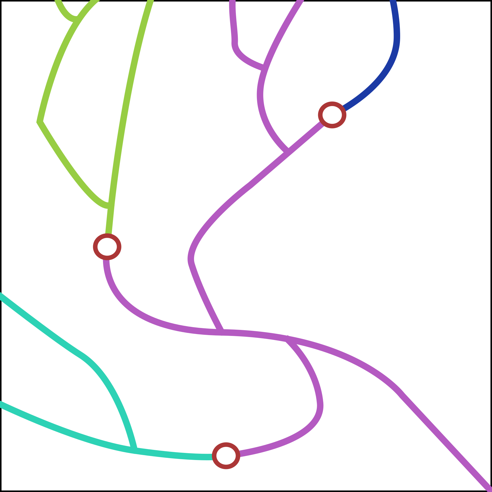
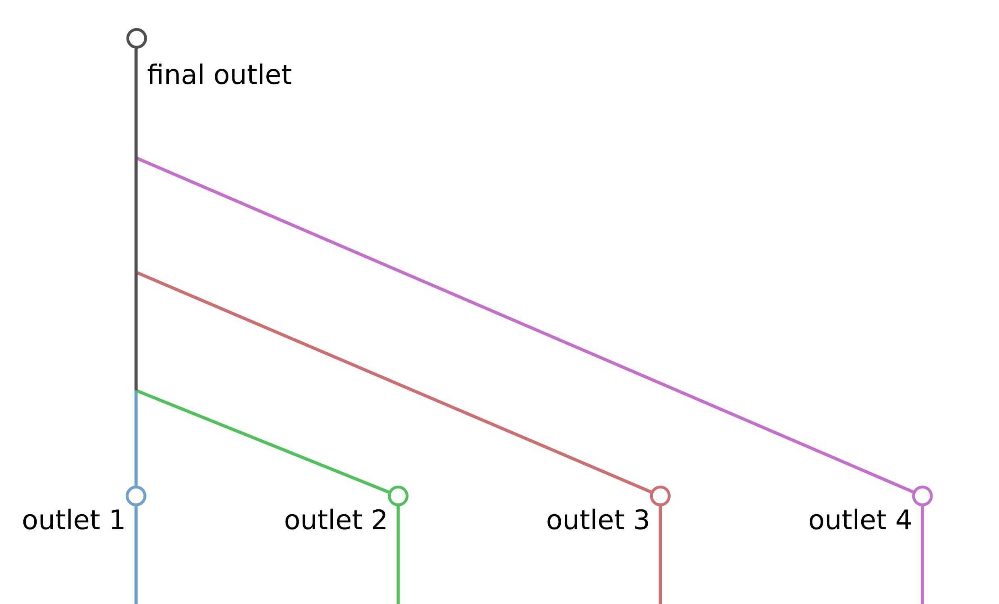
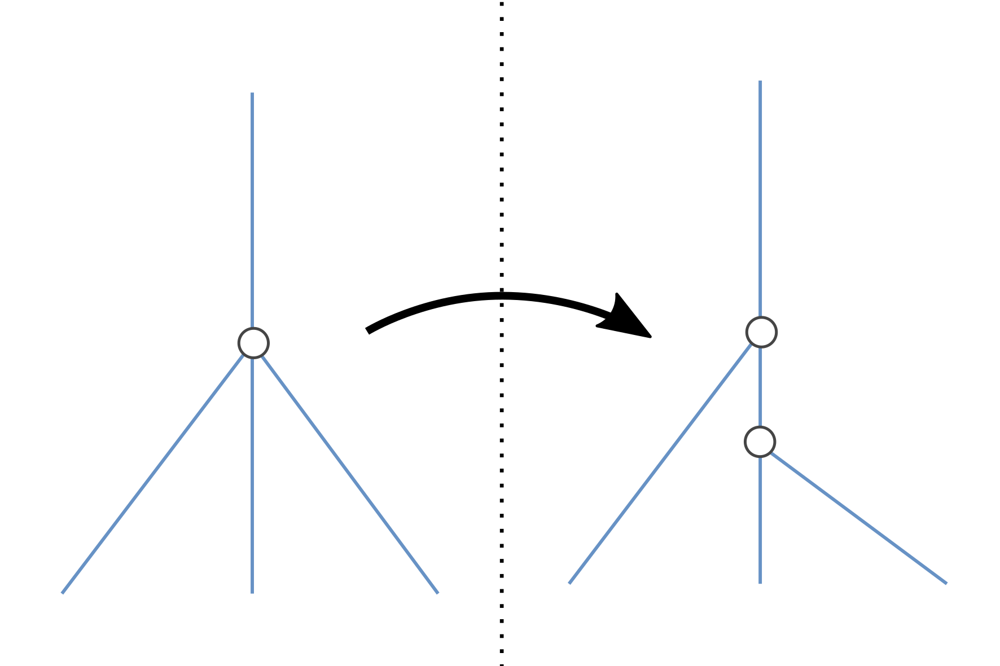

```{r setup, include=FALSE}
knitr::opts_chunk$set(echo = TRUE)
```

## 1. Overview

This guide will walk a user through a longitudinal connectivity analysis of the Chateauguay watershed. Connectivity analyses presented in this report are calculated by the [`dci` package](https://github.com/aarkilanian/dci) in R and geospatial manipulations are done in QGIS. The small `dci` package calculates the dendritic connectivity index (DCI, Cote et al., 2009) given spatial data of river lines and barriers to be considered. However, these spatial data must conform to certain criteria explained in subsequent sections and QGIS is used prior to connectivity analyses to ensure those criteria are respected.

At its base the DCI is a simple measure of structural connectivity and weighs all river reaches the same. However, the `dci` package allows for a biased calculation of connectivity which favors certain highly weighted reaches as more important to the watershed's regional connectivity. This weighting scheme is explored in the guide using urban and agricultural land use as proxies for fish habitat quality.

Finally, the workflow presented here is developed with the objective of rendering a ranking of river reaches in a watershed based on their importance to regional connectivity in the short and long term. To this end, a ranking is developed which combines multiple slightly different formulations of the DCI to capture the multiple facets of connectivity. In this formulation, there is a total of 3 different connectivity metrics calculated each for a different aspect of connectivity important for fish conservation: a long term measure, a short term measure, and an invasive measure which measures the watershed's connectivity to the source of invasive species at the mouth of the watershed. Additionally, in an effort to ensure these connectivity rankings remain robust in the face of habitat restoration in the region these metrics are recalculated for 4 levels of randomized restoration across the watershed. This leaves a total of 12 connectivity metrics.

| Scenario        | Metric         |
|-----------------|----------------|
| 0% restoration  | long-term DCI  |
| 0% restoration  | short-term DCI |
| 0% restoration  | invasive DCI   |
| 25% restoration | long-term DCI  |
| 25% restoration | short-term DCI |
| 25% restoration | invasive DCI   |
| 50% restoration | long-term DCI  |
| 50% restoration | short-term DCI |
| 50% restoration | invasive DCI   |
| 75% restoration | long-term DCI  |
| 75% restoration | short-term DCI |
| 75% restoration | invasive DCI   |

A 13th metric not considered here due to a lack of data is cultural value associated with certain river reaches. This quality of rivers could simply be integrated into the eventual rankings in the final section of this user guide.

## 2. The Dendritic Connectivity Index

The Dendritic Connectivity Index (DCI) comes in two related forms to relate specifically to the migration strategies of diadromous and potamodromous fishes. In this analysis, the potamodromous form is used for the short-term and long-term measures of connectivity. The diadromous form is only used in the invasive measure of connectivity with the assumption that the majority of invasive species are coming from the St. Lawrence River. Note that this analysis would require a reformulation to consider native potamodromous and diadromous fish together. The DCI considers fragmented river systems to consist of $n$ river segments based on the $M$ barriers on the entire network. An example of the way the DCI considers a fragmented river network is presented below with each river segment identified with a different colour and barriers in red circles.

{.class width="50%" height="50%" style="display: block; margin: 0 auto"}

The DCI then calculates the sum of connectivity between each pair of segments for the potamodromous form and only between the mouth and each segment in the diadromous form. Additionally, for this analysis, a habitat quality based weighting is applied to segments. The equations for these two forms of the DCI is presented below and explained further.

$$
DCI_{potamodromous} = \sum_{i=1}^{n}{ \sum_{j=1}^{n}{c_{ij} \frac{ql_i}{qL} \frac{ql_j}{qL} * 100}}
$$

$$
DCI_{diadromous} =  \sum_{i=1}^{n}{c_{ij} \frac{ql_i}{qL}  * 100}
$$

The connectivity between fragments $i$ and $j$ is measured as the product of their habitat quality weighted length ($ql_i$ and $ql_j$) relative to the habitat quality weighted length of the entire network ($qL$) multiplied by the passability of the barrier(s) which separate them ($c_{ij}$). This passability term is the product of the upstream and downstream passability of each barrier. In this case both upstream and downstream passabilities are considered to be equal.

In this analysis a short-term connectivity measure is used which imposes a distance limit to the calculation of the DCI. This is achieved by limiting the length of a segment by only considering rivers which lie within a distance threshold from the source segment in the calculation between each pair.

## 3. Data sources

### River data

The primary source for river data is the [Géobase du réseau hydrographique de Québec (GRHQ)](https://www.donneesquebec.ca/recherche/dataset/grhq). The GRHQ is a database of mapped rivers in Québec which includes, along with their location, some basic descriptive data about rivers such as Strahler order, distance from the nearest confluence, and intermittency. The GRHQ is specifically designed with network analyses in mind by ensuring ends of lines intersect correctly and don't braid over each other. The Chateauguay watershed is identified as 03AB in the GRHQ and the river lines are found in the "RH_L" layer. Note that this data layer includes some additional river lines which are not admissible in network analyses. Luckily these are identified in the GRHQ with the `ENABLED` and `PRIORITE` fields. Those rivers which have valid network topology have values of 1 and `PRIM` in these fields respectively. More details on these fields can be found in the GRHQ guide. These rivers are loaded and filtered below.

```{r message=FALSE, warning=FALSE}
# Load required packages
require(sf)
require(dplyr)
require(dci)
```

```{r fig.height=11, fig.width=16}
# Read in rivers
grhq_raw <- read_sf("data/chat_data.gpkg", layer = "grhq_raw") %>%
  # Discard Z dimension (sf cannot work with Z or M data)
  st_zm() %>%
  # Filter rivers with ENABLED set to 1
  filter(ENABLED == 1) %>%
  # Filter rivers with PRIORITE set to PRIM
  filter(PRIORITE == "PRIM")

# Plot the raw rivers
plot(st_geometry(grhq_raw))
```

### Barrier data

There are 3 types of barrier data which are considered and each come from a separate open data source:

-   **Dams** are imported from the [MELCC webpage](https://www.cehq.gouv.qc.ca/barrages/default.asp#version-telechargeable)
-   **Culverts** are imported from the [MTQ's Structure dataset](https://www.donneesquebec.ca/recherche/dataset/structure). Culverts are specified with the `code_des_t` codes of 11 through 21 inclusively.
-   **Waterfalls** are extracted directly from the point data included in the GRHQ. This corresponds to the C_hyd_p layer in the GRHQ GeoDatabase.

```{r}
# Read in dams
dams_raw <- read_sf("data/chat_data.gpkg", layer = "dams_raw") %>%
  # Match river data projection
  st_transform(st_crs(grhq_raw))

# Read in culverts
culverts_raw <- read_sf("data/chat_data.gpkg", layer = "culverts_raw") %>%
  # Match river data projection
  st_transform(st_crs(grhq_raw))

# Read in waterfalls
falls_raw <- read_sf("data/chat_data.gpkg", layer = "falls_raw") %>%
  # Match river data projection
  st_transform(st_crs(grhq_raw))
```

```{r fig.height=9, fig.width=14}
# Plot barriers all together
plot(st_geometry(grhq_raw), col = "grey50")
plot(st_geometry(dams_raw), col = "red", add = T, pch = 16)
plot(st_geometry(culverts_raw), col = "blue", add = T, pch = 16)
plot(st_geometry(falls_raw), col = "green", add = T, pch = 16)
```

As is obvious visually many barriers lie outside the Chateauguay watershed because of the ways in which data are packaged from the different sources. In addition, the southern part of the watershed does not have any data because that region of the watershed is found in the USA. In the next section of this guide the data will be cleaned and prepared for connectivity analyses.

### Other data

A final piece of required data is the location of the outlet of the watershed. This data consists of a single point at the final sink of the Chateauguay watershed. In this case, the watershed has multiple outlets and this is corrected in the subsequent section about river data preparation. A single unified outlet point will be generated at that point.

Some other optional data which are explored here are data associated with rivers which can serve as a weight during the connectivity analysis effectively biasing connectivity results to rank highly weighted rivers higher. In this case these consist of land use variables extracted from the [Cadre de Reference Hydrographique de Quebec (CRHQ)](https://www.donneesquebec.ca/recherche/dataset/crhq)

## 4. Data preparation

### River data

Raw river data requires considerable editing to be imported into the `dci` package. For DCI analyses to function properly river data must follow a strict dendritic topology wherein exactly two upstream rivers join together at confluences and form single downstream rivers. Due to the resolution of spatial data and the simplifying of rivers into one dimensional lines topological errors which violate the dendritic rules can arise. Specifically, these errors can either be too many rivers joining to form a single downstream river (complex confluences) or the splitting of a single river into two (divergent streams). In addition to these topological corrections there are other steps that must be taken to properly isolate the watershed of interest. The steps for cleaning and preparing the river data are:

1.  Isolate rivers of interest
2.  Generate single outlet
3.  Remove small isolated river fragments
4.  Correct topological errors
5.  Remove duplicate rivers
6.  Import rivers into the `dci` workflow

These steps are further developed and demonstrated in subsequent sub-sections. Note that steps 5 and 6 are not further explained. The rivers of the Chateauguay watershed from the GRHQ did not contain any duplicate rivers. Additionally, the importing of rivers into the `dci` workflow are done later in this case since weighting must first be calculated for these rivers.

#### Isolate rivers of interest

Many rivers in the south of what is considered the Chateauguay watershed are found across the US border. These rivers should be removed from the present analysis since only those which lie in Canadian jurisdiction are of interest for this analysis.

This filtering requires a spatial layer of the boundaries of the province of Quebec. In this case, data was downloaded from the [open data portal](https://open.canada.ca/data/en/dataset/a883eb14-0c0e-45c4-b8c4-b54c4a819edb) of the government of Canada. Following the acquisition of this spatial data rivers which lie north of the border can be extracted with a simple clipping operation in a GIS software. This can also be done in R. However, note that the clipping operation is much faster in QGIS than in R. For completeness some code to perform this operation in R is presented below.

```{r eval=FALSE}
# Read in Quebec boundary
qc_extent <- read_sf("data/chat_data.gpkg", layer = "qc_extent") %>%
  # Match river project
  st_transform(st_crs(grhq_raw))

# Clip rivers with Quebec polygon
# Note that this step takes long in R, it is much quicker in a GIS software
grhq_clipped <- grhq_raw %>%
  st_filter(qc_extent)
```

This clipping operation in R or another GIS system will leave only the rivers north of the border as illustrated below.

```{r fig.height=9, fig.width=14}
# Read in clipped rivers
grhq_clipped <- read_sf("data/chat_data.gpkg", layer = "grhq_clipped")

# Plot result of clipping
plot(st_geometry(grhq_raw), col = "red")
plot(st_geometry(grhq_clipped), add = T)
```

#### Generate single outlet

The Chateauguay watershed, as represented in the GRHQ, contains multiple sub-watersheds each with their own outlet draining into the St. Lawrence river at the northern end. However, for the purposes of connectivity analyses all these individual outlets should be joined together and drain into a single outlet representing the St. Lawrence river. This topological correction requires manual editing of rivers which can only easily be done in a dedicated GIS software such as QGIS.

Each individual outlet can be identified visually using a basemap representing the St. Lawrence river. Then, the end of the each river leading to an outlet should be extended to join a single other leading to one downstream river. This respects the rules of dendritic topology. Outlet rivers should be joined together this way until only one outlet remains. This process is illustrated below. Note also that, first, each river connecting an outlet to a confluence or a confluence to a confluence should be an individual line and, second, these rivers should have an attribute which indicates they are imagined rivers. This last step will ensure these imagined rivers are properly tagged and allow for their lengths to be excluded later in the connectivity analysis.

{#id .class width="50%" height="50%" style="display: block; margin: 0 auto"}

Below is the result of this outlet correction for the Chateauguay watershed. In red is the added portion linking outlets.

```{r echo = FALSE}
# Read in rivers with outlets joined
grhq_clean <- read_sf("data/chat_data.gpkg", layer = "grhq_outlets")

# Plot added lines
plot(st_geometry(grhq_clean), col = 'red')
plot(st_geometry(grhq_clipped), add = T)
```

#### Remove small isolated river fragments

Due to intermittency of some rivers or anthropogenic modifications small fragments of rivers can be found included in the watershed which are not connected to the main river network of the Chateauguay. The DCI is a watershed-level measure of connectivity. Thus, these small fragments will not influence the connectivity scores of larger fragmented rivers but they will slow down calculations. For the connectivity analysis we will only preserve the largest fully connected network in the watershed and this will be done with the help of the `dci` package. The `import_rivers` function, illustrated below, will ensure rivers are appropriate for connectivity analyses and extract the largest component (fully connected network) from the watershed.

```{r warning=FALSE}
# Load the dci package
require(dci)

# Import rivers with the dci package
rivers_in <- import_rivers(grhq_clean)
```

In this case, as can be seen from the removed red section, a large part of the watershed has been removed because it is not connected to the larger central segment.

#### Correct topological errors

The final pre-processing step for the rivers is to ensure all rivers follow a dendritic topology. Visually inspecting each confluence of the river network is impossible for a watershed of this size. However, the `dci` package has a `enforce_dendritic` function which is meant to aid in this task.

The `enforce_dendritic` function is written to be run either automatically or manually. Unfortunately, at the time of writing this guide, the automatic functionality of this tool is not complete. Regardless, whenever possible, doing this correction manually with the help of a GIS software like QGIS is recommended. In the manual mode, illustrated below, this function returns the spatial river data it was given with the addition of the `complexID` and `divergent` columns which identify complex confluences with too many inputs and divergent confluences with too many outputs respectively.

```{r}
# Identify topological errors in river data
grhq_err <- enforce_dendritic(rivers_in, correct = FALSE)
```

```{r}
# Plot complex confluences
plot(st_geometry(grhq_err), col = "grey50")
plot(grhq_err["complexID"], add = T)
```

As shown by the maps and output message of the function this river data contains 38 complex confluences and 0 divergent confluences that must be corrected. Often, solving complex confluences can lead to solving divergent confluences too. In addition, sometimes solving one can reveal another topological error. For this reason, it is recommended to correct complex confluences then re-run the `enforce_dendritic` function until all complex confluences are repaired. Then move on the divergent confluences. The following two sub-sections describe how to correct these errors in a GIS software.

##### Complex confluences

Complex confluences often arise when spatial resolution is not high enough to distinguish two closely located confluences. To correct these the end point of one of the confluence inputs should be moved to create a new confluence as illustrated. Note that the new segment which connected the two confluences should be a new line such that river intersections are correctly represented.

{.class width="50%" height="50%" style="display: block; margin: 0 auto"}

##### Divergent confluences

Divergent confluences often arise when there is a large structure in the river causing a river to split or it is the result of transforming lakes to lines. To correct these one of the divergent output streams needs to be removed such that only one input remains as illustrated.

{.class width="30%" height="30%" style="display: block; margin: 0 auto"}

### Barrier data

Barrier data require much less processing than river data. The processing steps are:

1.  Assign types and passabilities to barriers
2.  Merge barriers to a single data object
3.  Remove duplicate barriers
4.  Snap barriers to river lines
5.  Import barriers to the `dci` workflow with the `import_points` function

```{r}
# 1. Assign types and passabilities to barriers
culverts <- culverts_raw %>%
  # Rename ID
  rename("original_id" = "ide_strct") %>%
  mutate(original_id = as.character(original_id)) %>%
  # Assign culvert type
  mutate(type = "culvert") %>%
  # Assign passability
  mutate(pass = 0.8) %>%
  # Select relevant columns
  select(original_id, type, pass, geom)

dams <- dams_raw %>%
  # Rename ID
  rename("original_id" = "Numéro.ba") %>%
  mutate(original_id = as.character(original_id)) %>%
  # Assign culvert type
  mutate(type = "dam") %>%
  # Assign passability
  mutate(pass = 0.2) %>%
  # Select relevant columns
  select(original_id, type, pass, geom)

falls <- falls_raw %>%
  # Rename ID
  rename("original_id" = "ID_RHP") %>%
  mutate(original_id = as.character(original_id)) %>%
  # Assign culvert type
  mutate(type = "falls") %>%
  # Assign passability
  mutate(pass = 0) %>%
  # Select relevant columns
  select(original_id, type, pass, geom)

# 2. Merge barriers to a single data object
all_bar <- bind_rows(culverts, dams, falls)

# 3. Remove duplicate barriers
# This step along with step 4 are performed in QGIS for simplicity
# Removing duplicates is done with the "Remove duplicate geometries" tool

# 4. Snap barriers to river lines
# Snapping barriers is done with the "Snap geometries" tool
# To speed up the snapping a clipping operation could first be done to limit the number of 
# points to snap

# Read back barriers after QGIS operations
all_bar <- read_sf("data/chat_data.gpkg", layer = "all_bars")
glimpse(all_bar)

# 5. Import barriers to dci
chat_bars <- import_points(all_bar, "barriers")
```

```{r}
# Load corrected rivers
riv_final <- read_sf("data/chat_data.gpkg", layer = "grhq_final")

# Plot final barriers
plot(st_geometry(riv_final), col = "grey50")
plot(all_bar["type"], add = T, pch = 16)
```

### Outlet data

The outlet data consists of a single point. Once multiple outlets of the watershed are joined together to a final outlet for the watershed a point layer can be created which holds a single point at this new outlet. The only further processing required is to import the outlet to the `dci` workflow with `import_points`.

```{r}
# Read in outlet
out <- read_sf("data/chat_data.gpkg", layer = "outlet")

# Import outlet
chat_out <- import_points(out, "outlet")
```

## 5. Weighting

In this guide, land use is used as a proxy for habitat quality which serves as our weight for this analysis. Land use data was collected from the [CRHQ database](). The Chateauguay watershed corresponds to region 3 of the CRHQ. The CRHQ data are contained in points located on rivers. For this analysis a penalty was associated with high urban or agricultural land use but any other proxy or measure can be used. The steps in QGIS to extract a summary of CRHQ land use values for the GRHQ river lines are:

1.  Load the relevant region of the CRHQ
2.  Clip the CRHQ points based on the location of river lines. Unfortunately, CRHQ points often don't fall perfectly on rivers. For this reason it might be beneficial to buffer the CRHQ points and extract the relevant points this way.
3.  Join land use variables to CRHQ point locations. Different categories of variables are grouped together in a series of CRHQ tables. The land use variables are found in the `PtRef_bv_occ` table. Joining can be done based on the CRHQ point ID called `Id_PtRef`. The relevant columns for this analysis are `ant` which represents urban land use and the sum of `cau`, `cfo`, `cgi`, `cin`, and `cpi` which collectively represent different types of agricultural land use.
4.  Calculate a sum of agricultural land use types.
5.  Deal with unknown values. The CRHQ identifies missing values with the value of `-999`. Normally these values should be removed but for this example they will simply be converted to 0 as they represent a large part of the watershed's rivers.
6.  Snap CRHQ points to rivers. Often a very small distance value of 1m is enough.
7.  Summarize the values held in these CRHQ points onto the river lines on which they are located. This can be done in QGIS using the `Join attributes by location (summary)` tool.
8.  Set all `NULL` values in the mean agriculture and urban fields to `0`. These represent rivers for which CRHQ data is not available. We make the assumption that these rivers are not impacted by significant urban or agricultural land use.

```{r}
# Load rivers with land use variables summarized across them
grhq_weighted <- read_sf("data/chat_data.gpkg", layer = "grhq_crhq_join")

# Plot urban land use
plot(grhq_weighted["ant_mean"])

# Plot agricultural land use
plot(grhq_weighted["agr_mean"])
```

The next step after land use variables are summarized across the watershed's rivers is to convert these values to meaningful weights. All rivers start with an equal weighting of 1 and receive penalties based on land use data up to a maximum of 0.95. In this case the penalty scheme is as follows:

| Land use                   | Penalty |
|----------------------------|---------|
| agricultural \< 10         | 0       |
| agricultural \> 10 & \< 30 | 0.1     |
| agricultural \> 30 & \< 50 | 0.1     |
| agricultural \> 50 & \< 70 | 0.2     |
| agricultural \> 70 & \< 90 | 0.3     |
| agricultural \> 90         | 0.4     |
| urban \< 10                | 0       |
| urban \> 10 & \< 30        | 0.2     |
| urban \> 30 & \< 50        | 0.3     |
| urban \< 50 & \< 70        | 0.4     |
| urban \< 70 & \< 90        | 0.5     |
| urban \> 90                | 0.6     |

```{r}
# Convert land use to weighting
grhq_weighted <- grhq_weighted %>%
  # Compute agricultural penalty
  mutate(
    penalty_agr = case_when(
      agr_mean < 10 ~ 0,
      agr_mean >= 10 & agr_mean < 30 ~ 0.1,
      agr_mean >= 30 & agr_mean < 50 ~ 0.2,
      agr_mean >= 50 & agr_mean < 70 ~ 0.3,
      agr_mean >= 70 & agr_mean < 90 ~ 0.4,
      agr_mean >= 80 ~ 0.5
    )
  ) %>%
  # Compute urban penalty
  mutate(
    penalty_urb = case_when(
      ant_mean < 10 ~ 0,
      ant_mean >= 10 & ant_mean < 30 ~ 0.2,
      ant_mean >= 30 & ant_mean < 50 ~ 0.3,
      ant_mean >= 50 & ant_mean < 70 ~ 0.4,
      ant_mean >= 70 & ant_mean < 90 ~ 0.5,
      ant_mean >= 90 ~ 0.6
    )
  ) %>%
  # Combine penalties to get weighting
  mutate(weight = 1 - (penalty_urb + penalty_agr)) %>%
  # Set minimum weight to 0.05
  mutate(weight = pmax(weight, 0.05))

# Plot weighting result
plot(grhq_weighted["weight"])
```

At this point we can also exclude certain rivers from the analysis of connectivity by giving them a weight of 0 which effectively sets their river length to 0. This should be done with the rivers generated to join outlets. This can also be done with imagined rivers at lake locations since these are not technically rivers but allow for network algorithms to be effectively applied to river networks. However, in this case only the outlet lines are excluded.

```{r}
# Set weight of outlet lines to 0
grhq_weighted <- grhq_weighted %>%
  mutate(weight = if_else(included == "0", 0, weight))
```

## 6. Restoration scenarios

To ensure robust rankings simple restoration scenarios were simulated. This ensures that, if the landscape changes due to restoration efforts, these recommendations will still identify the most important rivers and barriers for regional connectivity. These simulations work by randomly selecting 25%, 50%, or 75% of rivers in the region and modifying their habitat quality to 1, the highest score. In a future application of this work a more realistic scenario of restoration would be preferable. For example, using knowledge of conservation on the ground to estimate regions of high conservation and restoration activity.

```{r}
set.seed(4523)

# Name the recently calculated weight as the 0% restoration weight
grhq_weighted <- grhq_weighted %>%
  rename(weight_0 = weight)

# Determine restoration targets for each scenario
rest_25 <- sample(1:nrow(grhq_weighted), size = 0.25*nrow(grhq_weighted))
rest_50 <- sample(1:nrow(grhq_weighted), size = 0.50*nrow(grhq_weighted))
rest_75 <- sample(1:nrow(grhq_weighted), size = 0.75*nrow(grhq_weighted))

# Compute restoration scenarios
# Set weight of targets selected in previous step to maximum of 1
grhq_weighted <- grhq_weighted %>%
  # 25% restoration
  mutate(weight_25 = if_else(row_number() %in% rest_25, 1, weight_0)) %>%
  # 50% restoration
  mutate(weight_50 = if_else(row_number() %in% rest_50, 1, weight_0)) %>%
  # 75% restoration
  mutate(weight_75 = if_else(row_number() %in% rest_75, 1, weight_0))
```

One of the categories of connectivity metrics to be calculated pertains to invasive species. Since these invasive species often tend to be more generalist than their endemic counterparts a specific habitat quality will be calculated for them which is simply the calculated habitat quality with smaller penalties for urban and agricultural land use.

```{r}
# Compute invasive habitat quality based on original quality measure
grhq_weighted <- grhq_weighted %>%
  # 0% restoration
  mutate(weight_inv_0 = pmin(weight_0 + 1, 1)) %>%
  # 25% restoration
  mutate(weight_inv_25 = pmin(weight_25 + 1, 1)) %>%
  # 50% restoration
  mutate(weight_inv_50 = pmin(weight_50 + 1, 1)) %>%
  # 75% restoration
  mutate(weight_inv_75 = pmin(weight_75 + 1, 1))
```

## 7. Connectivity calculation

The first step in performing the connectivity calculation now that all inputs are ready is to combine them together in a `river_net` object from the `dci` package. This can be done with the `river_net` function. This function performs many essential operations: ensuring the validity of spatial inputs, ensuring topological correctness, and assigning a binary search key to the river network for rapid network algorithms. This step can take a few minutes.

```{r eval=FALSE}
# Import rivers
chat_riv <- import_rivers(grhq_weighted)

# Prepare river_net
chat_net <- river_net(rivers = chat_riv,
                      barriers = chat_bars,
                      outlet = chat_out,
                      check = FALSE)
```

Once the `river_net` object is created calculating connectivity is done very easily using the `calculate_dci` function. This function has many parameters allowing the measurement of connectivity in different flavours. In total we are looking to calculate 12 indices. Note the use of the n.cores argument which allows for multi-threaded calculations based on the number of cores you'd like to use. However, at the moment, this option is only available on Linux and Mac operating systems.

```{r}
# Create table of parameter values for the 12 runs
form.list <- c("potamodromous", "potamodromous", "potamodromous", "potamodromous",
          "potamodromous", "potamodromous", "potamodromous", "potamodromous",
          "diadromous", "diadromous", "diadromous", "diadromous")

weight.list <- c("weight_0", "weight_25", "weight_50", "weight_75",
            "weight_0", "weight_25", "weight_50", "weight_75",
            "weight_inv_0", "weight_inv_25", "weight_inv_50", "weight_inv_75")

threshold.list <- c(NULL, NULL, NULL, NULL,
               14000, 14000, 14000, 14000,
               NULL, NULL, NULL, NULL)

print(data.frame(form.list, weight.list, threshold.list))

# Run DCI calculation in a loop with list of arguments
dci.runs <- mapply(calculate_dci,
                   form = form.list,
                   weight = weight.list,
                   threshold = threshold.list,
                   MoreArgs = list(net = chat_net, 
                                   pass = "pass", 
                                   n.cores = 12))
```

Now with the parameters prepared for the `calculate_dci` function, we can run this function for each 12 metric in a loop with the `mapply` function.

```{r eval=FALSE}
# Calculating long-term potamodromous DCI (no distance threshold)
# 0% restoration
full_pot_0 <- calculate_dci(net = chat_net,
                          form = "potamodromous",
                          pass = "pass",
                          weight = 'weight_0',
                          n.cores = 16)
# 25% restoration
full_pot_25 <- calculate_dci(net = chat_net,
                            form = "potamodromous",
                            pass = "pass",
                            weight = 'weight_25',
                            n.cores = 16)
# 50% restoration
full_pot_50 <- calculate_dci(net = chat_net,
                            form = "potamodromous",
                            pass = "pass",
                            weight = 'weight_50',
                            n.cores = 16)
# 75% restoration
full_pot_75 <- calculate_dci(net = chat_net,
                            form = "potamodromous",
                            pass = "pass",
                            weight = 'weight_75',
                            n.cores = 16)

# Calculating short-term potamodromous DCI
# 0% restoration
thresh_pot_0 <- calculate_dci(net = chat_net,
                          form = "potamodromous",
                          pass = "pass",
                          weight = 'weight_0',
                          threshold = 14000,
                          n.cores = 16)
# 25% restoration
thresh_pot_25 <- calculate_dci(net = chat_net,
                            form = "potamodromous",
                            pass = "pass",
                            weight = 'weight_25',
                            threshold = 14000,
                            n.cores = 16)
# 50% restoration
thresh_pot_50 <- calculate_dci(net = chat_net,
                            form = "potamodromous",
                            pass = "pass",
                            weight = 'weight_50',
                            threshold = 14000,
                            n.cores = 16)
# 75% restoration
thresh_pot_75 <- calculate_dci(net = chat_net,
                            form = "potamodromous",
                            pass = "pass",
                            weight = 'weight_75',
                            threshold = 14000,
                            n.cores = 16)

# Calculating diadromous invasive DCI
# 0% restoration
full_dia_0 <- calculate_dci(net = chat_net,
                          form = "diadromous",
                          pass = "pass",
                          weight = "weight_inv_0",
                          n.cores = 16)
# 25% restoration
full_dia_25 <- calculate_dci(net = chat_net,
                          form = "diadromous",
                          pass = "pass",
                          weight = "weight_inv_25",
                          n.cores = 16)
# 50% restoration
full_dia_50 <- calculate_dci(net = chat_net,
                          form = "diadromous",
                          pass = "pass",
                          weight = "weight_inv_50",
                          n.cores = 16)
# 75% restoration
full_dia_75 <- calculate_dci(net = chat_net,
                          form = "diadromous",
                          pass = "pass",
                          weight = "weight_inv_75",
                          n.cores = 16)
```

Each of these results is held in a `dci.results` object. It is required to combine them into a single data object to perform the final ranking step in this analysis. The `export_dci` function will help in this task. Unfortunately, at this time, there isn't a more concise way to perform this task.

```{r eval=FALSE}
# Export results onto rivers
rivers <- export_dci(chat_net, full_pot_0, "rivers") %>%
  select(-DCI, -DCI_rel) %>%
  dplyr::left_join(full_pot_0, by = c("member.label" = "segment")) %>%
  dplyr::left_join(full_pot_25, by = c("member.label" = "segment"), 
                   suffix = c("_pot_0", "_pot_25")) %>%
  dplyr::left_join(full_pot_50, by = c("member.label" = "segment")) %>%
  dplyr::left_join(full_pot_75, by = c("member.label" = "segment"), 
                   suffix = c("_pot_50", "_pot_75")) %>%
  dplyr::left_join(full_dia_0, by = c("member.label" = "segment")) %>%
  dplyr::left_join(full_dia_25, by = c("member.label" = "segment"), 
                   suffix = c("_dia_0", "_dia_25")) %>%
  dplyr::left_join(full_dia_50, by = c("member.label" = "segment")) %>%
  dplyr::left_join(full_dia_75, by = c("member.label" = "segment"), 
                   suffix = c("_dia_50", "_dia_75")) %>%
  dplyr::left_join(thresh_pot_0, by = c("member.label" = "segment")) %>%
  dplyr::left_join(thresh_pot_25, by = c("member.label" = "segment"), 
                   suffix = c("_thr_0", "_thr_25")) %>%
  dplyr::left_join(thresh_pot_50, by = c("member.label" = "segment")) %>%
  dplyr::left_join(thresh_pot_75, by = c("member.label" = "segment"), 
                   suffix = c("_thr_50", "_thr_75")) %>%
  select(O_STRAHLER, riv_length, ant_mean:DCI_rel.thresh75) %>%
  select(-ag_pen, -urb_pen, -tot_pen, -rivID, -geometry.y, -fid.y)

# Export results onto barriers
barriers <- sf::st_as_sf(activate(chat_net, nodes)) %>%
  dplyr::filter(.data$type %in% c("barrier", "outlet")) %>%
  dplyr::left_join(full_pot_0, by = c("member.label" = "segment")) %>%
  dplyr::left_join(full_pot_25, by = c("member.label" = "segment"), 
                   suffix = c("_pot_0", "_pot_25")) %>%
  dplyr::left_join(full_pot_50, by = c("member.label" = "segment")) %>%
  dplyr::left_join(full_pot_75, by = c("member.label" = "segment"), 
                   suffix = c("_pot_50", "_pot_75")) %>%
  dplyr::left_join(full_dia_0, by = c("member.label" = "segment")) %>%
  dplyr::left_join(full_dia_25, by = c("member.label" = "segment"), 
                   suffix = c("_dia_0", "_dia_25")) %>%
  dplyr::left_join(full_dia_50, by = c("member.label" = "segment")) %>%
  dplyr::left_join(full_dia_75, by = c("member.label" = "segment"), 
                   suffix = c("_dia_50", "_dia_75")) %>%
  dplyr::left_join(thresh_pot_0, by = c("member.label" = "segment")) %>%
  dplyr::left_join(thresh_pot_25, by = c("member.label" = "segment"), 
                   suffix = c("_thr_0", "_thr_25")) %>%
  dplyr::left_join(thresh_pot_50, by = c("member.label" = "segment")) %>%
  dplyr::left_join(thresh_pot_75, by = c("member.label" = "segment"),
                   suffix = c("_thr_50", "_thr_75")) %>%
  select(-type, -fid, -node.label)

```

```{r}
# Load computed DCI results
chat_res_riv <- read_sf("data/chat_res.gpkg", layer = "rivers")
chat_res_bar <- read_sf("data/chat_res.gpkg", layer = "barriers")
```

These final results have a column for each of the 12 calculated connectivity metrics. They follow an intuitive 3 part construction separated by underscores. The first element indicates this is a DCI measure, the second element indicates the type of connectivity measured (`pot` for potamodromous, `dia` for diadromous which is the invasive connectivity measure, and `thr` for thresholded potamodromous), and the third element indicates the level of restoration either 0%, 25%, 50%, or 75%.

## 8. Ranking determination

Finally with our suite of connectivity metrics calculated for each river reach in the watershed we can combine these together and produce a final ranking of streams based on a combination of these calculated connectivity metrics. First, all these connectivity scores are converted to ranks. Note that all DCI measures except the invasive DCI are ranked in opposite order since the `rank` function of R ranks the lowest numbers as highest ranking. Then, the rank product is calculated with these 12 to derive a final ranking. In this case, each connectivity metric is weighed equally but alternative weightings can be used to reflect specific conservation priorities. These calculations are only done for the barriers.

```{r}
# Compute ranks
chat_res_bar <- chat_res_bar %>%
  mutate(rankp0 = rank(-DCI_pot_0)) %>%
  mutate(rankp25 = rank(-DCI_pot_25)) %>%
  mutate(rankp50 = rank(-DCI_pot_50)) %>%
  mutate(rankp75 = rank(-DCI_pot_75)) %>%
  mutate(rankd0 = rank(DCI_dia_0)) %>%
  mutate(rankd25 = rank(DCI_dia_25)) %>%
  mutate(rankd50 = rank(DCI_dia_50)) %>%
  mutate(rankd75 = rank(DCI_dia_75)) %>%
  mutate(rankth0 = rank(-DCI_thr_0)) %>%
  mutate(rankth25 = rank(-DCI_thr_25)) %>%
  mutate(rankth50 = rank(-DCI_thr_50)) %>%
  mutate(rankth75 = rank(-DCI_thr_75)) %>%
  # Compute rank product
  mutate(final_rank = rankp0 * rankp25 * rankp50 * rankp75 *
                      rankd0 * rankd25 * rankd50 * rankd75 *
                      rankth0 * rankth25 * rankth50 * rankth75 / 12)
```

## 9. Conclusions

These final rankings are a composite score of connectivity across many facets. They combine short and long term connectivity with invasion risk and help to identify important regions in the Chateauguay watershed for endemic potamodromous fish connectivity. They also consider changes in the landscape through restoration simulations to ensure connectivity rankings remain robust in the face of a changing watershed. In this final section I explore the limitations of this analysis as it's been developed here and suggest future directions to improve its ability to generate realistic estimates of connectivity.

### Limitations

This workflow looks to generate the best estimates of connectivity given sparse data about fish species' habitat, behaviour, and locations. For these reasons and in the interest of creating a simple methodology the workflow presented here has a number of limitations which should be considered when it is applied:

-   

### Future directions

While these metrics and rankings provide a good starting understanding of connectivity in the watershed there are many data and advanced procedures which could serve to develop more robust recommendations from this analysis. Recommendations for future development on this analysis are provided below in no particular order:

-   **Barrier passability** The barrier passabilities used in this analysis were determined based on previously published analyses. However, due to differences in species' swimming abilities, the passability of a barrier can be different for different species. There exist a number of methods (for example the FishXing software) to also include the specific dimensions of barriers to better understand then their installation can cause significant fragmentation for fish.

-   **Habitat quality** In this analysis land use was used as a proxy for habitat quality in the interest of simplicity and the illustration of a new methodology. In a future iteration of this analysis where a group of focal species are chosen a habitat suitability model could provide a more realistic estimate of habitat quality.

-   **Migration strategies** This analysis focuses primarily on potamodromous fish and only uses the diadromous measure of the DCI for the invasive connectivity estimate. A future iteration of this workflow could alter the suite of connectivity measures assessed to better consider a wider range of fish migration strategies.

-   **Barrier priorities** The final ranking achieved by this workflow relates to the importance of each river segment in the overall connectivity of a watershed. This is not the same as prioritizing barriers for removal or remediation. The literature on prioritizing barriers in this way is quite rich and it can be achieved through sequentially removing each combination of barriers and recalculating the DCI each time to give each barrier a value of connectivity change. However, this can be tedious and impossible with a large watershed. The solution for large watersheds is to perform mathematical optimization considering the cost of barrier remediation against the benefit to fish connectivity.
